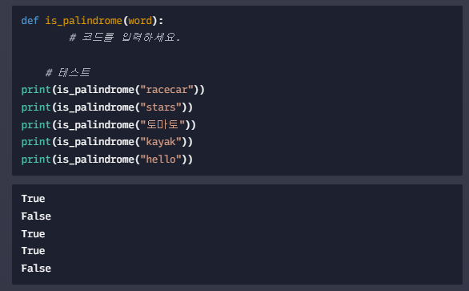

## 🌲 chapter1. 알고리즘이란?


## 01. 알고리즘이란? 

> 목적은 같지만 방법이 조금씩 다르다. 같은 문제를 해결하기 위해 다양한 알고리즘이 존재한다. 
>
> EX) 라면 끊이는 순서


#### ◼ 좋은 알고리즘이란? 

**(1) 문제를 해결하는 것**  **(2) 문제를 더 잘 해결하는 것** 


#### ◼  컴퓨터 알고리즘이란? 

> 컴퓨터가 어떤 문제를 해결하기 위해서 컴퓨터가 이해할 수 있는 방식으로 정리되어 있는 해결 방법 

```python
# 정렬 

[9, 4, 10, 3, 5, 8, 12, 1] # 뒤죽박죽
[1, 3, 4, 5, 8, 9, 10, 12] # 정렬됨

# 우리는 정확하고 효율적으로 숫자들을 정렬하는 알고리즘을 찾아야한다. 
# 또한 이 알고리즘을 어떻게 구현하느냐? 당연히 프로그래밍을 이용하여 한다. 그래서 
# 프로그래밍과 알고리즘은 뗄 수 없는 관계이다. 
```


---


## 02. 알고리즘이 바꾸는 세상 


#### ◼ 네비게이션 어플 

> * 어떤 어플을 사용해야 할까? 
>
> 두 회사에서 각각 네비게이션 어플을 출시했다고 가정해 보자, 둘다 디자인이 훌륭하고, 사용성도 나쁘지 않다. 그렇다면 어떤 어플을 사용해야 할까?
>
> 우선 길을 정확하게 알려주고 도착 시간도 정확하게 알려줘야한다. 틀린 정보를 알려주는 어플은 사용안하기 떄문 두번째로는 길을 빨리 알려줘야 한다. 만약 길 한 번 찾아주는 것이 2분씩이나 걸리면 답답해서 사용을 안하기 때문이다. 
>
> 결론적으로 누가 더 정확하고 효율적인 알고리즘을 사용하는지가 중요하며 서비스의 성공여브가 알고리즘에 달려 있음을 알 수 있다. 


#### ◼ 영화 어플 

> 넷플릭스가 추천해주는 영화 _ 평점 순으로 추천해주는 것이 아닌 데이터를 기반으로 개개인에 맞춰 영화를 골라주는 것이다. 이것도 알고리즘의 역할이다. 
>
> 넷플릭스에서는 추천 알고리즘을 개선하고 싶어서 대회를 열기도 했는데, 1등한 팀은 무려 10억원이 넘는 상금을 받아갔다. 그만큼 넷플릭스라는 서비스에게 알고리즘이 중요한 역할을 차지하고 있음을 알 수 있다. 


#### ◼ 알고리즘의 중요성 

> 네비게이션이나 영화 어플 외에도 알고리즘은 거의 모든 분야에서 핵심적인 역할을 맡고 있다. 
>
> 예전에는 서비스를 만드는 것 자체만으로도 의미가 있었지만 이제는 소프트웨어 개발에 대한 진입장벽이 많이 낮아졌기 떄문에 무언가 차별성이 필요하다. 기술적으로 얼마나 잘 구현이 되었는지 즉 알고리즘이 얼마나 좋은 지에 따라 서비스의 성패가 갈리는 경우도 많다. 


---


## 03. 알고리즘을 모르는 개발자 


#### ◼ 알고리즘은 개발자의 기본 소양이다?

> 유능한 개발자들의 대부분은 알고리즘적 사고력을 갖추고 있고 대표적인 알고리즘 정도는 다 꿰고 있다. 


#### ◼ 알고리즘은 개발자의 실력 

> 소통의 문제를 떠나, 알고리즘은 결과물에서도 차이를 만들어 낸다. 
>
> 분명 사용자 수는 천천히 늘어나는데, 사이트가 심각할 정도로 느려졌다. 아무리 봐도 뭐가 문제인지 모르겠는데 알고리즘을 공부한 친구가 보더니 금방 해결 할 수 있었다. 효율성에 대해 조금만 신경써도 쉽게 해결 할 수 있는 부분이었다. 
>
> 어렵고 복잡한 문제를 푸는 사람에게나 알고리즘 공부가 필요한 줄 알았지만, 모든 프로그램에 알고리즘이 포함되어 있다는 걸 몸소 알게 되었고, 그래서 알고리즘 공부를 하면 평소 개발한 때에도 확실히 더 좋은 코드를 작성 할 수 있다는 확신이 생겼다. 


#### ◼ 회사 가려면 알고리즘 잘해야 한다. 

> Google, Facebook, Amazon 등 대기업들을 포함한 대부분의 회사에서는 개발자를 뽑을 때 알고리즘 테스트를 진행합니다. 그중에서 대기업들은 특히 알고리즘을 거의 가장 중요한 평가 기준으로 봅니다. 
>
> 실무적인 경험이 부족하더라도 알고리즘적 사고력이 검증된 지원자라면, 나머지는 충부히 가르칠 수 있다고 판단을 한다. 반대로 알고리즘을 잘 모르는 개발자라면 좋은 대우를 받기 어렵다. 
>
> 취업이라는 현실적인 상황을 고려해도 알고리즘 공부는 의미 있는 투자라는 생각이 드네요!


---


#### ✔ 실습 과제 

> 팔린드롬 문제 
>
> `"토마토"`나 `"기러기"`처럼 거꾸로 읽어도 똑같은 단어를 팔린드롬(palindrome)이라고 부릅니다. 문자열 `word`가 팔린드롬인지 확인하는 함수 `is_palindrome`를 쓰세요. `is_palindrome`은 `word`가 팔린드롬이면 `True`를, 팔린드롬이 아니면 `False`를 리턴합니다.



> `"racecar"`과 `"토마토"`는 거꾸로 읽어도 똑같기 때문에 `True`가 출력되어야 하고, `"hello"`는 거꾸로 읽으면 `"olleh"`가 되기 때문에 `False`가 나와야합니다.

> **[ 주 의 사 항 ]** 
>
> - 반드시 for문을 사용하셔야 합니다.
> - `append`, `insert` 메소드와 `del` 함수를 사용하면 안됩니다.
> - 자동 채점 과제이기 때문에, 문제의 조건에 정확히 따라주시기 바랍니다. 띄어쓰기도 일치해야 합니다.


```python
def is_palindrome(word):
    # 코드를 입력하시오.
    return(word == word[::-1])

# 테스트
print(is_palindrome("racecar"))
print(is_palindrome("stars"))
print(is_palindrome("토마토"))
print(is_palindrome("kayak"))
print(is_palindrome("hello"))
      

```


---


## chapter2. 하나의 문제, 여러가지 알고리즘


## 01. 하나의 문제를 해결하는 여러가지 방법

> 만약, '로미오와 줄리엣'이라는 책을 도서관에서 찾고 싶다면 어떤 방법으로 찾아봐야할까?
>
> 책이 알파멧 순 A ~ Z으로 정리되어 있다는 점을 이용하여 중간 지점쯔음에 있는 책을 하나 골라 제목을 보고  '로미오와 줄리엣'이 알파벳 순서상 이 책 보다 왼쪽에 있다면 이제 오른쪽 반은 볼 필요도 없다. 
>
> 또 남은 책 들 중에 딱 중간 지점에 있는 골라서 본다면 '로미오와 줄리엣'이 알파멧 순서상 이 책 보다 오른쪽에 있다면 이제 왼쪽 반을 제외할 수 있다. 
>
> 이러한 방법으로 반복하다 보면 찾고자 하는 책을 찾을 수 있을 것이다. 또한 같은 문제도 여러가지 방법으로 해결할 수 있고 어떤 방법으로 푸느냐에 따라 걸리는 시간이 달라진다. 


## 02. 선형탐색과 이진 탐색 

* #### 탐색 문제

  * 프로그래밍에서 가장 간단하면서도 대표적인 문제 중에 하나인 탐색 문제 
  * 저장된 정보들 중에서 **원하는 값**을 찾는 것 
  * EX) 도서관에서 원하는 책을 찾기 위해 탐색하는 것 
  * EX) 파이썬 리스트에 숫자들이 있을 때 5라는 숫자가 어디 있는지 탐색하는 것 


#### 💡 선형 탐색 알고리즘 (linear search algotithm)

> 하나씩 쭉 보는 것을 선형 탐색 알고리즘이라 한다. 


#### 💡 이진 탐색 알고리즘 (binary search algotithm)

> 반씩 제외하면서 찾는 것을 이진 탐색 알고리즘이라 한다. 


---


#### ✔ 실습 과제 

> #### 선형 탐색 구현해보기
>
> '선형 탐색(Linear Search)' 알고리즘을 사용해서 어떤 원소가 리스트 안에 포함되어 있는지 확인하려고 합니다. 선형 탐색이란, 리스트의 처음부터 끝까지 순서대로 하나씩 탐색을 진행하는 알고리즘입니다.
>
> 파라미터로 탐색할 값 `element`와 리스트 `some_list`를 받는 함수 `linear_search`를 작성하세요. 0번 인덱스부터 순서대로 하나씩 확인해서 만약 `element`를 `some_list`에서 발견할 시 그 위치(인덱스)를 리턴해 주면 됩니다.
>
> `element`가 `some_list`에 존재하지 않는 값이면 `None`을 리턴해주세요.


> [주 의 사 항]
>
> - `element in some_list`와 같이 `in` 키워드를 사용하는 건 안 됩니다. 선형 탐색에 대한 이해를 테스트하는 과제이기 때문에, 반드시 반복문을 사용해서 해결해 주셔야 합니다.
> - 자동 채점 과제이기 때문에, 문제의 조건에 정확히 따라주시기 바랍니다. 띄어쓰기도 일치해야 합니다.
> - 힌트를 최대한 보지 않고, 스스로의 힘으로 푸시는 것이 좋습니다. 만약 도저히 모르겠다면, 최소한의 힌트만 참고해주세요!


```python
def linear_search(element, some_list):
    for i in range(len(some_list)):
        if some_list[i] == element:
            return i
    return None

# 테스트
print(linear_search(2, [2, 3, 5, 7, 11]))
print(linear_search(0, [2, 3, 5, 7, 11]))
print(linear_search(5, [2, 3, 5, 7, 11]))
print(linear_search(3, [2, 3, 5, 7, 11]))
print(linear_search(11, [2, 3, 5, 7, 11]))
```


---


#### ✔ 실습 과제 

> #### 이진 탐색 구현해보기
>
> ‘이진 탐색(Binary Search)’ 알고리즘을 사용해서 어떤 원소가 리스트 안에 포함되어 있는지 확인하려고 합니다. 이진 탐색 알고리즘은 선형 탐색 알고리즘과 달리, 정렬된 리스트를 전제로 합니다. 정렬된 리스트가 아니면 이 알고리즘은 적용이 불가능합니다.
>
> 왜 이 알고리즘의 이름이 ‘이진 탐색’일까요? 1회 비교를 거칠 때마다 탐색 범위가 (대략) 절반으로 줄어들기 때문입니다.

> **예를 들어 `[1, 2, 3, 5, 8, 13, 21, 34, 55]`에서 `3`을 찾는 경우, 알고리즘의 진행 방식은 다음과 같습니다:**
>
> #### 시도 1
>
> 리스트의 첫 번째 인덱스와 마지막 인덱스의 값을 합하**여 2로 나눈 후, 중간 인덱스로 지정**합니다. 그리고 그 인덱스에 해당하는 값이 `3`인지 확인해봅니다.
>
> 이 경우 리스트의 첫 번째 인덱스는 0이고 마지막 인덱스는 8이기 때문에, 중간 인덱스는 4이고 해당 원소는 `8`입니다. **찾고자 하는 원소(`3`)는 중간 원소(`8`)에 비해 작습니다.** 리스트는 정렬되어 있으니, 이제 인덱스 4~8은 탐색 범위에서 제외시킬 수 있습니다. 탐색 범위가 절반으로 줄어든 것이죠.
>
> #### 시도 2
>
> 탐색 범위는 이제 인덱스 0~3입니다. 탐색 범위의 첫 번째 인덱스는 0이고 마지막 인덱스는 3이기 때문에, 중간 인덱스는 **`(0 + 3) // 2`인 1입니다. 인덱스 1에 해당하는 원소는 `2`이죠**.
>
> 찾고자 하는 원소(`3`)는 중간 원소(`2`)에 비해 큽니다. 리스트는 정렬되어 있으니, 이제 인덱스 0~1은 탐색 범위에서 제외시키면 됩니다. 탐색 범위가 다시 절반으로 줄어든 것이죠.
>
> #### 시도 3
>
> **탐색 범위는 이제 인덱스 2~3입니다.** 탐색 범위의 리스트의 첫 번째 인덱스는 2이고 마지막 인덱스는 3이므로, 중간 인덱스는 **`(2 + 3) // 2`인 2입니다. 인덱스 2에 해당하는 원소의 값은 `3`이죠.**
>
> 찾고자 하는 원소(`3`)는 중간에 해당하는 원소(`3`)와 일치합니다. 값을 찾았으니, 인덱스 2를 리턴해주며, 알고리즘을 종료합니다.


```python
def binary_search(element, some_list):
    start_index = 0
    end_index = len(some_list) - 1
    
    while start_index <= end_index:
        midpoint = (start_index + end_index) // 2
        if some_list[midpoint] == element:
            return midpoint
        elif some_list[midpoint] > element:
            end_index = midpoint - 1
        else:
            start_index = midpoint + 1
    return None

print(binary_search(2, [2, 3, 5, 7, 11]))
print(binary_search(0, [2, 3, 5, 7, 11]))
print(binary_search(5, [2, 3, 5, 7, 11]))
print(binary_search(3, [2, 3, 5, 7, 11]))
print(binary_search(11, [2, 3, 5, 7, 11]))
```


---


## 03. 탐색 알고리즘 비교 


#### ◼ 선형 탐색 알고리즘 


>* 길이 : 16개 
>* 가장 금방 되는 경우 : 1번
>* 가장 오래 걸리는 경우 : 16번


#### ◼ 이진 탐색 알고리즘 


> * 길이 : 16개
> * 가장 금방 되는 경우 : 1번 (찾는 값이 19였는데 중앙값이 19이므로 1번)
> * 가장 오래 걸리는 경우 : 4번


#### 🤔 언제 선형탐색과 이진탐색을 사용하면 좋을까?

* **정렬이 된 리스트 : 선형 탐색 (O), 이진 탐색(O)**
* **정렬이 안된 리스트 : 선형 탐색(O), 이진 탐색(X)**


---


## 04. 선택 정렬

* #### 정렬 (Sorting)

  * 원소들을 **특정 순서로 정리**하는 것 
  * 리스트를 오름차순, 내림차순 또는 알파벳 순서로 정리 가능 
  * Python 에서는 sorted 내장함수도 있고 리스트에 있는 sort 메소드 

  ```python
  some_list = [12, 6, 4, 17, 11, 15, 1, 30]
  sorted(some_list)
  some_list.sort()
  ```

  * 왜 정렬을 배워야 할까? 다양한 방식으로 문제를 해결할 수 있기 때문

    `정렬은 알고리즘의 기초입니다. 즉, 정렬을 배우면서 문제 해결의 기초를 다질 수 있습니다. `

    `그리고 정렬은 모든 개발자가 알아야 하는 가장 기본적인 알고리즘이기 때문에`


#### 💡 선택 정렬(Selection Sort)

* 가장 먼저 생각이 날 수 있는 **자연스러운 정렬 알고리즘** _ 직관적인 알고리즘 
* 가장 작은 값을 찾아 0번의 인덱스로 넣고 그 다음 작은 값을 찾아서 순서대로 인덱스에 넣어준다. 


#### 💡 삽입 정렬 (Insertion Sort)

* 삽입 정렬은 선택 정렬과 다르게 각 값이 어떤 위치로 가야 할지 찾는 것이다. 

* EX) 카드 게임 : 이미 갖고 있는 카드와 새로운 카드를 뽑고 난 후 **새로운 카드를 올바른 위치에 삽입**

```python
# 이미 갖고 있는 카드 
[2, 5, 6, 8, 9]
# 새로 뽑은 카드 : 7
[2, 5, 6, 7, 8, 9]
```


---


* #### [Sorting Algorithms Animations](https://www.toptal.com/developers/sorting-algorithms) : 정렬 알고리즘의 퍼포먼스 볼 수 있는 사이트

* #### 정렬에는 퀵정렬, 힙정렬, 거품정렬 등 정렬 여러 알고리즘이 있다. 

  * 어떤 알고리즘이 더 좋은 걸까? : 상황에 따라 각 알고리즘의 장단점을 파악하여 문제를 해결

  * 삽입 정렬 : 이미 정렬된 리스트를 정렬 할때 삽입정렬이 가장 빠르다.

  * 힙 정렬 : 무작위 순서의 리스트를 정렬할때 힙 정렬이 가장 빠르다. 

  * 선택정렬과 합병정렬은 상황에 영향을 받지 않고 일정한 시간이 소요된다는 점 알고 있기

    

---


## chapter3. 알고리즘 평가법


## 01. 평가의 두 기준 : 시간과 공간

> * 알고리즘을 공부할 때 신경써야 할 것 : **시간 & 공간**
>
>  _ 공간(컴퓨터의 저장 공간 : 메모리를 최대한 적게 사용해야 좋은 프로그램)


* 너무 다양한 외부 환경에 영향을 받기 때문에 단순히 프로그램이 돌아가는 시간으로 알고리즘을 비교하는 건 합리적이지 않다. 
* 컴퓨터 과학에서는 그냥 시간을 재는 것이 아니라 **시간 복잡도 Time Complexity** 라는 개념을 사용

* **시간 복잡도** _ **데이터가 많아질 수록 걸리는 시간이 얼마나 급격히 증가하는지 나타내는 개념** 

