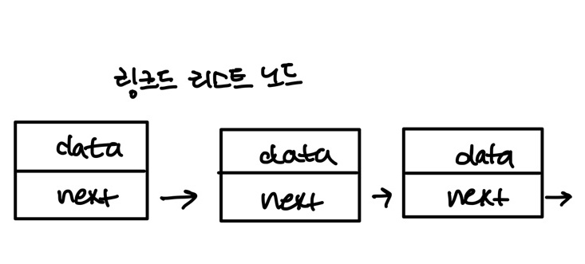

# 💡그래프란?

### 01. 연결 관계 데이터와 그래프 

🤔그래프란? 

> **연결 데이터를 저장할 수 있는 자료 구조** 이다. 

자료구조를 공부하는 이유는 상황에 맞는 방식으로 데이터를 저장하고 사용하기 위해서이다. 

데이터 사이에 어떤 관계가 있는지에 따라 적절한 자료구조를 골라 사용해야 한다. 

ex) 앞과 뒤라는 관계를 저장하고 싶다면, **배열이나 링크드 리스트와 같은 선형적 자료구조**를 사용해야 하면 된다. 

ex) **계층적 관계**를 저장하고 싶다면, **트리**를 사용하면 된다. 

🤔그렇다면, 그래프는 어떤 상황에서 사용하게 될까? **그래프는 연결관계를 위해 사용**

##### **(1) 위치 데이터** 

우리들에게 가장 익숙한  연결 데이터는 어떤 것들이 있을까? = **위치 데이터** 

ex ) 지하절 app = 빠른 경로를 찾아준다. : 이는 모두 연결 관계 덕분이며 연결관계가 있는 **두 장소 간의 최단 경로를 계산**하는 것이다. 

 

##### (2) 사회 연결망 데이터

페이스북에서 친구관계, 인스타그램 팔로우 이러한 정보들은 모두 연결 관계로 이뤄져 있다. 

추천하는 친구 목록도 연결 관계로 볼 수 있다. 

##### (3) 다양한 연결 관계 

위치에 관한 데이터나 사회 관계 데이터는 우리의 생활과 직접적으로 연결된 정보이다. 또한 연결관계는 학문에서도 큰 역할을 한다. 

* ##### 통신 : 수많은 컴퓨터들의 연결 관계인 인터넷 

* ##### 생물 : 유전자와 단백질의 상호작용 관계 

---

### 02. 그래프 기본 

> 친구관계 데이터를 통해 그래프의 기본 개념에 대해 알아보고자 한다. 

링크드 리스트의 기본 데이터 단위가 노드였다. 

##### ◼ 노드 : 저장하려는 데이터와 다른 노드에 대한 레퍼런스를 저장함 이 레퍼런스를 통해 데이터들 사이에 이렇게 **선형적인 관계**를 만들었다. 

그래프도 노드라는 기본적인 단위를 사용하며 이 동그라미가 **그래프의 노드**라고 하자, 

그래프로 친구 관계를 표현하려고 한다면, 여기서는 그래프 노드가 한 명의 사람을 나타내면 된다. 

이 노드는 영훈이라는 사람을 나타내고자 한다면, 

👉 **마찬가지로 현승, 동욱, 지웅, 규리, 소원이라는 그래프 노드를 만들 수 있다.** 

이 노드들 사이에 친구라는 관계를 만들어 주고 싶다면?  그래프에서는 **노드들 사이에 있는 관계를 엣지**라고 한다. 그냥 선으로 표현한다면,

**영훈과 현승 사이**에 엣지를 만들어 주면 서로 친구 관계가 있다는 것을 표현하는 것이고 또 엣지를 만들어 준다면 **규리와 소원사이**에 친구 관계가 있는 것이다. 

=> 영훈과 현승 사이를 잇는 이 엣지는 (**영훈, 현승)엣지 또는 (현승, 영훈)엣지** 이렇게 부른다. 반면  (규리, 소원)엣지 또는 (소원, 규리)엣지이다. 

그래프에 나머지 엣지들을 다 추가해 주다면, 좀 더 복잡한 그래프를 만들 수 있다.

#### 🔻 그래프에서 자주 사용하는 용어 

#### (1) 서로 인접하다, 서로 인접해 있지 않다. 

영훈과 동욱 사이에는 엣지가 있다. 두 데이터 사이에 친구 관계가 있다는 뜻이며  이런 식으로 두 노드가 엣지로 연결 되어 있을 때 서로 인접해 있다. 라고 한다. 

따라서  노드 영훈과 동욱 사이에는 엣지가 있기 때문에 **서로 인접하다**고 하지만 지웅과 규리 사이에는 엣지가 없기 때문에 **서로 인접해 있지 않다**고 한다. 

---

#### (2) **지웅과 규리는 서로 친구가 아니지만 둘다 모두 소원과 친구인가?**

그렇다면, 지웅과 규리는 지웅 - 소원 - 규리 또는 반대로 규리 - 소원 - 지웅을 통해서 연결되어 있으므로 이럴때 지웅과 규리를 잇는 이 길을 경로 라고 한다. 

지웅과 규리가 서로 인접해 있지는 않지만 이 경로를 통해 연결 되어 있기에 이럴 때는 지웅과 규리는 **지웅 - 소원 - 규원 경로를 통해 연결**이 되었다고 표현한다. 

**경로를 다시 살펴본다면?**

지웅에서 규리까지 가는데 2개의 엣지를 거쳐야 하고 이 때  **이 경로의 거리는 2**라고 한다. 

이 경로 안에 있는 **엣지의 수**를 이야기 하는 것이다. 이 경로가 지웅과 규리 사이의 **최단 경로**가 되는 것이다. 

**자세히 살펴보자면,** 지웅과 규리 사이에는 지웅 - 소원 - 규리 경로도 있지만 지웅 - 현승 - 소원 - 규리 경로도 있다.  

이 경로 말고도 두 노드 사이에는 굉장히 많은 경로가 존재할 수 있으며 또는 아예 경로가 없을 수 있다.  

두 노드 사이에 있을 수 있는 수 많은 경로들 중 특별한 경로들이 몇개가 있다. 

---

#### (3) **먼저 두 노드들 사이에 가장 거리가 작은 경로를 최단 경로라고 한다.** 

지금 같은 경우에는 지웅 - 소원 - 규리 경로는 거리가 2이고 이것 보다 더 짧은 경우는 없기에 

이 경로가 지웅과 규리 사이의 최단 경로가 되는 것이다. 

---

#### (4) **특정 노드에서 다시 그 노드로 돌아오는 경로는 사이클이라고 한다.** 

지웅 - 현승 - 소원 - 지웅 이 경로를 본다면, 지웅 노드 에서 시작하여 다시 지웅 노드에서 끝나는 경로이다. 이것을 바로 **사이클** 이라고 한다. 

---

#### (5) **한 노드가 갖고 있는 엣지의 수를 차수라고 한다.** 

영훈 노드는 현성, 동욱 노드와 엣지로 연결되어 있고 이때 **영훈 노드는 차수가 2**인 것이다. 

반면 동욱 노드는 영훈 노드와 밖에 연결이 안되어 있기에 **동욱 노드는 차수가 1**인 것이다. 

차수를 이용하면 노드에 대해 유용한 데이터를 알아낼 수 있다. 

지금 같은 경우에는 차수가 각 노드의 친구의 수를 나타낸다. 누가 몇 명의 친구가 있는지 알고 싶다면, 차수를 확인하면 된다. 

----

----

### 03. 방향 그래프 

친구관계라는건 쌍방향, 영훈과 동욱이 친구면 그 반대로 동욱과 영훈이 친구라는 것이다. 엣지가 쌍방향이면 오히려 방향이 없다고 이야기 할 수 도 있다.  그래서 그래프를 **무방향 그래프 (undirected graph)** 라고도 한다. 

인스타그램 팔로우 관계를 생각해 본다면, 내가 누구를 팔로우하면 그 사람이 나를 팔로우 해야 하는 건 아니다. 나 혼자 팔로우로 끝날 수 도 있기에, 팔로우 관계에 방향을 주어 그래프를 만들어야 한다. 

친구 관계 그래프의 노드들을 그대로 인스타그램 사용자로 생각하고 방향이 있는 엣지를 만들어 보자면 

화살표로 엣지의 방향을 나타내고, 화살표의 뒤에 있는 현승은 화살표가 가리키고 있는 지웅을 팔로우 하고 있다는 것을 나타낸다. **반면 지웅에서 현승을 가리키는 화살표가 없기에, 지웅은 현승을 팔로우 하고 있지 않는 것이다.** 

**이러한  엣지는 현승을 떠나 지웅으로 들어가는 엣지라고 표현한다.** 

무방향 그래프에서는 (지웅, 현승) 엣지와 (현승, 지웅) 엣지가 똑같았다, 방향 그래프에서는 엣지가 떠나는 노드를 항상 앞에 사용하고 들어가는 노드를 뒤에 적어준다. 

다른 엣지들도 넣어주면 다음과 같은 방향 그래프를 만들 수 있다. 

그래프 엣지는 단순히 연결되었다는 것을 넘어, **방향성을 가질 수 있다.** 

하지만 방향성이 있다고 해서 **쌍방향이 불가능한 것은 아니다.** 팔로우 관계에서도 

**서로를 팔로우 할 수 있고 (맞팔)**

이럴때는 **현승에서 지웅으로 가는 엣지와 지웅에서 현승으로 가는 엣지 2개**를 만들어 주면 된다. 

엣지에 방향이 생기게 되면 무방향 그래프와 조금 달라지는 부분들은 다음과 같다. 

#### (1) 경로

: 방향 그래프에서는 경로에도 방향이 있다. 

: 지금 현승에서 떠나서 영훈으로 들어가는 엣지가 있고 또 현승을 떠나 지웅으로 들어가는 엣지도 있기에 엣지가 양면일때는 영훈 - 현승 - 지웅의 경로가 할 수 있었다고 했다. 

: 지금과 같은 경우는 엣지들의 방향 때문에 영훈에서 지웅까지 가는 경로가 없는 것이다. 

#### (2) 차수 

: 무방향 그래프에서 차수는 단수히 노드에 연결된 엣지의 수이다. 

: 방향 그래프에서 차수를 2개로 나눈다. 

: 노드에서 나가는 엣지의 수를 출력 차수 그리고 노드로 들어오는 엣지의 수를 입력 차수라고 부른다. 

: **현승 노드의 출력 차수는2, 입력 차수는 1**

---

### 04. 가중치 그래프 

ex) 항공 경로 데이터를 그래프로 나타내는 예시 

> 각 노드는 하나의 공항을 나타낸다. 그리고 한 공항과 다른 공항에서 서로 오가는 비행기가 있다면, 두 공항은 연결이 되어 있는 것이다. 인천공항, LA공항, 그리고 뉴욕 공항은 서로 오갈 수 있는 항공편이 있기 때문에 서로 엣지로 연결되어 있다. 
>
> 이 공항들이 연결되어 있는 것은 똑같다. 생각해 본다면, 인천 공항에서 LA공항까지 가는 비행시간과 LA공항에서 뉴욕 공항까지 가는 비행 시간 인천 공항에서 뉴욕 공항까지 가는 비행시간은 다 다르다. 

이러한 사황에서 엣지에 특정 숫자값을 지정해 줄 수 있는 가중치 그래프를 사용하면 된다. 

(가중치 그래프를 사용하면 공항들의 연결 관계를 좀 더 정확하게 나타낼 수 있다. )

> (인천, LA) 엣지는 가중치 9 / (LA, 뉴욕) 엣지는 가중치 5 / (뉴욕, 인천) 엣지는 가중치 13 

**모든 엣지의 값이 동일한 그래프를 무가중치 그래프**라고 한다. 

* 공항 데이터 뿐만 아닌, 도시를 연결하는 일반 도로 데이터 등 가중치 그래프를 활용할 수 있는 예시는 매우 많다. 가중치 그래프를 사용한다면 경로의 거리 개념이 조금 바뀐다. 

* 무가중치 그래프에서 거리는 단순히 경로에 있는 엣지의 수였지만  **가중치 그래프에서 거리는 경로에 있는 모든 엣지 가중치의 합이다.** 

EX) 무가중치 그래프를 사용하면 인천 - LA - 뉴욕 경로의 거리는 2인 반면에 가중치 그래프에서는 엣지들의 가중치와 5와 9를 더해 14가 되는 것이다. 

